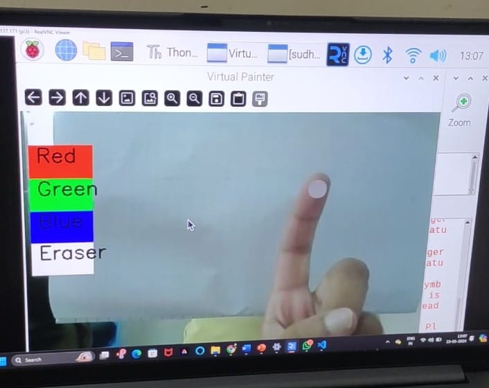

# 🎨 ArtFlowPi – AI Virtual Painter with Index Finger Tracking

[](https://github.com/KnowME-AS-Aditya/ArtFlowPi)
[](https://github.com/KnowME-AS-Aditya/ArtFlowPi/stargazers)
[](https://github.com/KnowME-AS-Aditya/ArtFlowPi)
[](https://github.com/KnowME-AS-Aditya/ArtFlowPi/issues)

---

## 🧠 What is ArtFlowPi?

**ArtFlowPi** is an **AI-powered virtual canvas** that lets users draw using their **index finger tracked via webcam** — no touchscreen or mouse needed!

It uses:
- 🖐️ [MediaPipe](https://google.github.io/mediapipe/) for real-time **hand landmark detection**
- 🎥 OpenCV for webcam & canvas operations
- 🎨 Custom GUI with color palette & eraser
- 🍓 **Raspberry Pi support** for edge-level AI drawing
- 📝 [IEEE Xplore](https://ieeexplore.ieee.org/document/10094385) for references

---

## 🖼️ Project Preview

| 👇 Live Drawing Feed | 🎯 Canvas Output |
|----------------------|------------------|
|  |  |

> 🔁 Replace with actual GIF/screenshot after you record using ShareX or ScreenToGif.

---

## ⚙️ Tech Stack

| Tech        | Role                           |
|-------------|--------------------------------|
| **Python**  | Core programming language      |
| **OpenCV**  | Video capture, canvas overlay  |
| **MediaPipe** | Hand landmark & index tracking |
| **NumPy**   | Canvas manipulation            |
| **Raspberry Pi** | Optional processor platform |

---

## 🚀 Getting Started

```bash
# Clone the repo
git clone https://github.com/KnowME-AS-Aditya/ArtFlowPi.git
cd ArtFlowPi

# Install dependencies
pip install -r requirements.txt

# Run the app
python ArtFlowPi_primary.py
```
⚠️ Requires a webcam or a Raspberry pi cam. Works best on systems with OpenCV + MediaPipe installed.

🎨 Features
Draw using your index finger

Choose between Red, Green, Blue brushes

Use Eraser with fingertip too

Press 'c' to clear the canvas

Press 'q' to exit

📡 Hardware Compatibility  
Device	Status :-  
 Laptop/Desktop	    ✅ Fully supported  
 Raspberry Pi (3B+)	✅ Tested with webcam  
 Jetson Nano	       🟡 Experimental  
 Android via OTG	   🔴 Not supported yet  

🛠️ Future Scope  
⫸ Add hand gesture-based controls

⫸ Save canvas output as image

⫸ Add brush size and shape options

⫸ Use TFLite for faster Pi inference

⫸ Web version with Flask/Gradio  

## Final Notes
  
The Virtual Painter Application serves as the focal point of this endeavor, harnessing the power of AI algorithms to simulate the artistic process. By analyzing input images or user prompts, the application generates original artworks, imbued with stylistic elements inspired by renowned artists or artistic movements.  								    
By integrating this AI-driven painting tool onto the Raspberry Pi platform, we aim to democratize access to artistic expression and foster creativity among enthusiasts, hobbyists, and professionals alike.   	   
The compact size, low cost, and computational capabilities of the Raspberry Pi make it an ideal vehicle for deploying AI applications, enabling users to explore the boundaries of art and technology in a portable and accessible manner.  							         
Throughout this exploration, we will examine the underlying AI models powering the Virtual Painter Application, the technical considerations involved in integrating it with the Raspberry Pi, and the potential implications for the future of art and technology.


🙌 Credits:  
Developed with 💙 by [Aditya Ranjan Sahoo](https://www.linkedin.com/in/aditya-ranjan-sahoo-277722259/)


📜 License
This project is licensed under the Apache 2.0 License.
See the [LICENSE](LICENSE) file for details.

